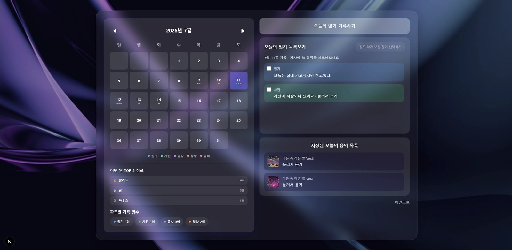
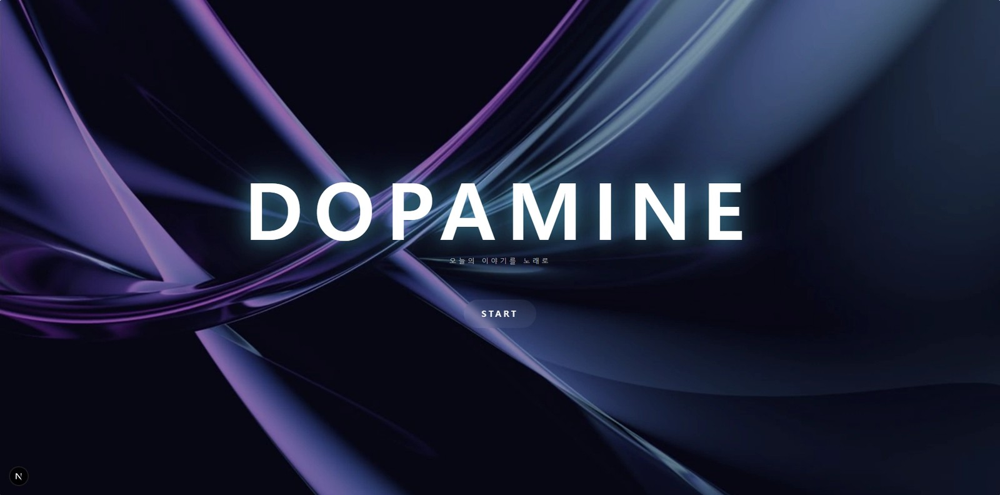
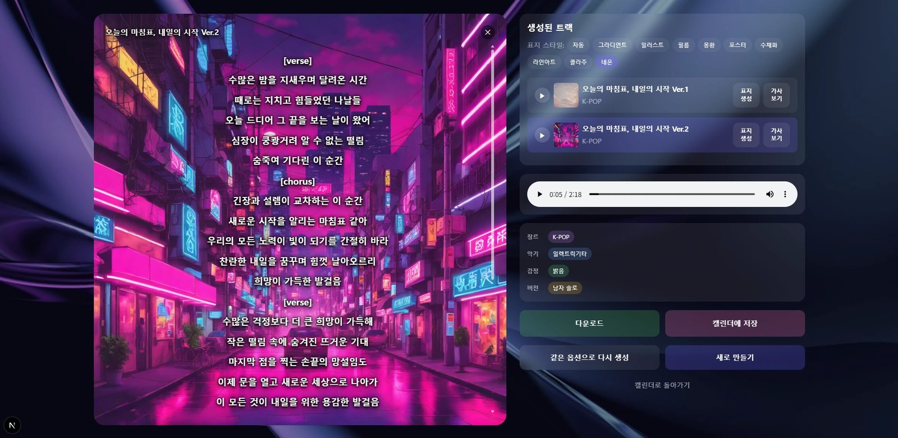
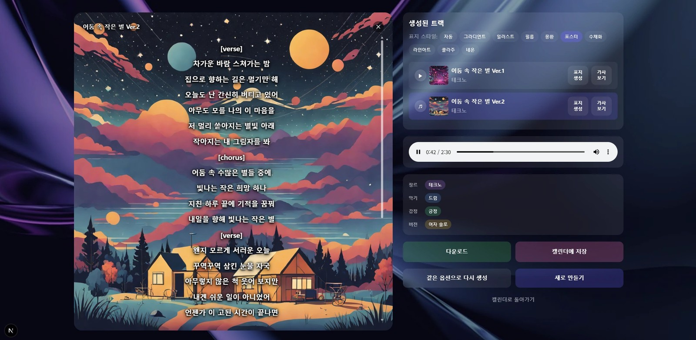

# Dopamine — 감정을 음악으로 기록하는 AI 서비스

일기·사진·음성·영상을 입력하면 **AI가 가사, 음악, 앨범 커버를 생성**해 주는 감정 기록 서비스입니다. 생성형 AI ICT 공모전 출품작이며, 2인 팀으로 개발했습니다.

🔗 [Portfolio](https://subinlu22.github.io) · [발표 자료 (PDF)](https://subinlu22.github.io/assets/projects/dopamine-presentation.pdf)


*홈 화면 — 날짜별 일기와 생성된 음악 확인*

---

## 데모

[](https://youtu.be/BAMX8Uf0CLA)

## 프로젝트 개요

| 항목 | 내용 |
|---|---|
| 기간 | 2026.06 ~ 2026.07 (7/17 제출) |
| 인원 | 2인 |
| 출품 | 생성형 AI ICT 공모전 |
| 컨셉 | "감정을 음악으로 기록하세요" |

| 팀원 | 담당 |
|---|---|
| 정수빈 ([subinlu22](https://github.com/subinlu22)) | AI 파이프라인(가사·음악·커버 생성), 백엔드 |
| [eunjeong0305](https://github.com/eunjeong0305) | 프론트엔드 |

## 구현 현황

| 기능 | 상태 |
|---|---|
| 감정 입력 (일기 / 사진 / 음성 / 영상) | ✅ |
| 장르·악기·길이 선택 → 길이를 반영한 가사 생성 (Gemini) | ✅ |
| 완성곡 2개(Ver.1 / Ver.2) 생성 후 선택 (ACE-Step) | ✅ |
| 레퍼런스 음악 업로드 | ✅ |
| 앨범 커버: 기본 그라데이션 커버 | ✅ |
| 앨범 커버: AI 커버 생성 (SDXL-Turbo, 스타일 5종) | ✅ |
| 앨범 커버 위 가사 오버레이 | ✅ |

**시도 후 제외한 것**

| 시도 | 결과 |
|---|---|
| 20초 미리듣기 → 풀버전 재생성 | ❌ 같은 seed여도 길이가 다르면 새로 생성되어 멜로디가 달라짐 → 풀버전 2곡 생성으로 변경 |
| ACE-Step `extend` 기능 | ❌ 로컬 서버의 task_type 목록에 없음 (lego / extract / complete / cover / repaint / text2music만 존재) |
| 가사 싱크 자동 보정 (Silero VAD → Demucs 보컬 분리 + 음량 지속시간) | ❌ 4차례 시도, 곡마다 정확도가 일정하지 않아 기능에서 제외 |
| AI 커버를 다운로드 mp3에 반영 | ❌ AI 커버는 화면에서만 교체됨 |

## 환경

| 구분 | 내용 |
|---|---|
| OS | Windows |
| 프론트엔드 | Next.js (React), Tailwind CSS |
| 백엔드 | Python, FastAPI |
| AI 모델 | Gemini API (가사), ACE-Step 1.5 (음악, 로컬 GPU), SDXL-Turbo (커버, 로컬 GPU) |
| 이미지 | Pillow (기본 커버) |
| GPU | VRAM 약 12GB급 로컬 GPU |
| 협업 | GitHub — `feature/backend` · `feature/frontend` → `integration` → `main` |

## 시스템 구조

```
[노래 생성]
브라우저 → POST /generate-music (Ver.1) → ACE-Step 음악 생성 + Pillow 기본 커버
        → POST /generate-music (Ver.2, reuse_cover_filename=Ver.1 커버) → ACE-Step 음악 생성만

[AI 커버 생성] (완성 화면의 🎨 버튼)
POST /generate-cover-sdxl (title, emotion, genres, instruments, style)
   → full_pipeline.py가 subprocess로 generate_cover_standalone.py 실행
   → SDXL 로드 · 생성 · 저장 후 프로세스 종료 (GPU 메모리 100% 반환)
   → 성공 시 새 cover_url 반환 / 실패 시 Pillow 기본 커버로 대체
```

| API | 설명 |
|---|---|
| `POST /generate-music` | 가사·옵션·레퍼런스 음악(multipart/form-data)으로 노래 생성. `reuse_cover_filename`으로 커버 재사용 |
| `POST /generate-cover-sdxl` | 제목·감정·장르·악기·스타일로 AI 앨범 커버 생성 |

## 앨범 커버 스타일

`gradient` · `illustration` · `film` · `dreamy` · `poster` — 스타일마다 문장 후보를 여러 개 두고 무작위 선택해 결과가 한 가지로 획일화되지 않게 했습니다. 사람·동물·캐릭터는 SDXL이 손을 잘 그리지 못해 "배경·사물·풍경 위주"로 프롬프트를 고정했습니다.

## 화면

| | |
|---|---|
|  |  |
| 서비스 시작 화면 | AI 노래 생성 결과 |
|  | |
| AI 노래 생성 결과 | |

## 설계 결정과 근거

| 결정 | 근거 |
|---|---|
| 미리듣기를 없애고 풀버전 2곡을 바로 생성 | 같은 seed여도 길이가 다르면 새로 생성되어 미리듣기와 풀버전 멜로디가 일치하지 않음 |
| 화면 순서를 "옵션 선택 → 가사 생성"으로 변경 | 길이 정보 없이 가사를 만들면 서버 기본값(60초) 분량이라 노래 길이와 맞지 않음 (인트로가 30초씩 늘어짐) |
| SDXL을 별도 프로세스로 분리 | `empty_cache()`는 PyTorch 내부 캐시만 비우고, CUDA 컨텍스트는 프로세스가 살아 있는 동안 GPU에서 반환되지 않음 |
| `/generate-music`은 SDXL 없이 Pillow 커버만 사용 | 노래 생성은 항상 빠르고 안정적으로 유지, AI 커버는 버튼으로 분리 |
| 성공 판정을 "결과 파일이 실제로 생겼는지"로 변경 | stdout 문자열 파싱은 버퍼링·인코딩으로 조용히 깨짐 |

## 트러블슈팅

| 문제 | 원인 | 해결 |
|---|---|---|
| 노래+커버를 같이 생성하면 두 번째부터 5분 넘게 타임아웃 | `nvidia-smi` 확인 결과 GPU 메모리 11458/12282MB 점유, 이전 ACE-Step 프로세스가 좀비로 남아 있었음. `empty_cache()`는 효과 없음 | `taskkill`로 정리 후, SDXL을 독립 프로세스로 분리 (커버 생성마다 20~30초 추가) |
| 남자 그룹 선택 시 여자 목소리 출력 | 프론트 "남성 그룹/여성 그룹"과 백엔드 "남자 그룹/여자 그룹" 명칭 불일치 | 명칭 통일 |
| 가사가 중복 재포맷됨 | 미리듣기·완성본에서 각각 재포맷 | `already_reformatted` 플래그 |
| Tailwind 스타일이 적용되지 않음 | `postcss.config`(v4)와 `global.css`(v3 문법) 불일치 | `@import "tailwindcss";`로 교체 |
| 레퍼런스 음악이 백엔드로 전달되지 않음 | 파일 선택 UI만 있고 `musicOptions`에 미포함, JSON 요청 | `multipart/form-data`로 전환 |
| 브랜치 병합 중 `start_all.bat` 삭제, 이전 커밋의 API 키 노출 | 브랜치마다 파일 추적 여부가 달라 병합 시 로컬 파일이 삭제됨 | 구조 복원, 노출된 API 키 폐기 후 재발급, 이후 민감 파일은 커밋하지 않음 |

## 프로젝트 구조

```
Dopamine/
├── backend/
│   ├── server.py                      # API 엔드포인트
│   ├── full_pipeline.py               # 노래 생성 + SDXL subprocess 호출
│   ├── generate_cover_standalone.py   # SDXL을 실제로 실행하는 독립 스크립트
│   ├── analyze_vocals_standalone.py   # 보컬 구간 분석 (실험, 최종 미적용)
│   ├── test_cover.py                  # 커버 단독 테스트
│   └── test_music_flow.py             # 노래 2곡 흐름을 UI 없이 테스트
└── app/
    ├── page.jsx                       # Ver.1 / Ver.2 순차 요청
    └── components/musicresult.jsx     # 🎨 버튼, 스타일 선택, 가사 오버레이
```

## 실행 방법

1. `.env`에 `GEMINI_API_KEY`를 설정합니다. (저장소에는 포함되어 있지 않습니다)
2. ACE-Step 로컬 서버와 SDXL-Turbo 실행이 가능한 GPU 환경을 준비합니다.
3. `start_all.bat`으로 백엔드와 프론트엔드를 함께 실행합니다.
4. 서버를 다시 시작할 때는 이전 터미널을 모두 닫습니다. 응답이 점점 느려지면 `nvidia-smi`로 GPU 메모리와 프로세스를 먼저 확인합니다.

---

🔗 [Portfolio](https://subinlu22.github.io)
